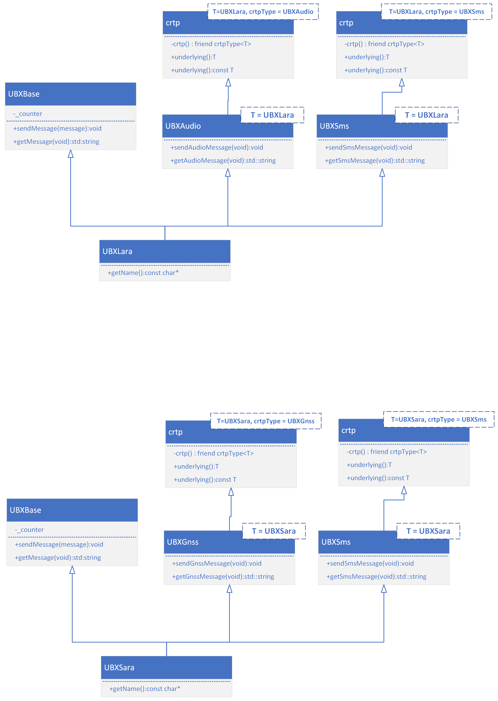

This example uses a the class ```crtp``` to "abstract" out the constant use of ```static_cast<T>(this)``` to make a call on the base class.

A macro (*gasp*) ```ubxBase``` is also used to make using this very simple.

### Class diagram


